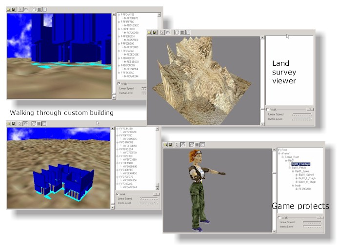



## VB DirectX8 OCX beta v1\.0

### Description

Free DX8 control to build simple 3D scenes, load 3D DXF, X , lands and custom files. Walk mode, trackball mode, easy texturing, 3D world simulation, object tree.
 
### More Info
 

             |
---                |---
**Submitted On**   |2001-02-16 15:55:50
**By**             |[Fabio Guerrazzi](https://github.com/Planet-Source-Code/PSCIndex/blob/master/ByAuthor/fabio-guerrazzi.md)
**Level**          |Advanced
**User Rating**    |4.0 (20 globes from 5 users)
**Compatibility**  |VB 6\.0
**Category**       |[DirectX](https://github.com/Planet-Source-Code/PSCIndex/blob/master/ByCategory/directx__1-44.md)
**World**          |[Visual Basic](https://github.com/Planet-Source-Code/PSCIndex/blob/master/ByWorld/visual-basic.md)
**Archive File**   |[CODE\_UPLOAD150752162001\.zip](https://github.com/Planet-Source-Code/fabio-guerrazzi-vb-directx8-ocx-beta-v1-0__1-21075/archive/master.zip)

